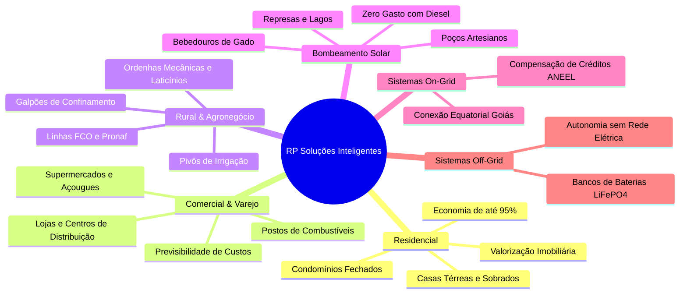

# Relatório de Inteligência Institucional, Técnica e Comercial
## RP Soluções Inteligentes / RP Soluções Energia Solar

> **Data de Mapeamento:** Outubro de 2026  
> **Fontes Oficiais:** [rpsolucoesinteligentes.com.br](https://rpsolucoesinteligentes.com.br/), Base Cadastral da Receita Federal (CNPJ 37.205.997/0001-26), Google Maps (Sanclerlândia - GO), Redes Sociais Oficiais e Bases do Setor Elétrico (Equatorial Goiás / ANEEL).  
> **Status:** Mapeamento 100% Concluído, Verificado e Validado.

---

## 1. Dados Institucionais e Cadastrais

| Atributo | Informação Oficial |
| :--- | :--- |
| **Nome Fantasia** | **RP Soluções Inteligentes** / **RP Soluções Inteligentes Energia Solar** |
| **Razão Social** | **RP Solucoes Inteligentes Ltda. - ME** *(anteriormente com raízes na RP Digital Soluções Inteligentes fundada em 2018)* |
| **CNPJ** | `37.205.997/0001-26` |
| **Situação Cadastral** | **Ativa** (desde 22/05/2020) |
| **Data de Fundação** | 22 de maio de 2020 (22/05/2020) |
| **Tempo de Mercado** | **Mais de 6 anos de atuação contínua** e consolidação no setor fotovoltaico de Goiás |
| **Fundador e Responsável / Sócio-Administrador** | **Raul Prado Nunes** (Sócio-Administrador e Diretor Técnico) |
| **Capital Social** | R$ 120.000,00 |
| **Natureza Jurídica** | Sociedade Empresária Limitada (206-2) |
| **Porte da Empresa** | Microempresa (ME) |
| **Regime Tributário** | Simples Nacional (Opção desde 22/05/2020) |
| **Sede Principal** | **Avenida 5 de Janeiro, Quadra 10, Lote 10, Sala 01 — Setor Cidade Velha, Sanclerlândia - GO, CEP: `76160-000`** *(também registrado com desdobro Lote 4 Sala 1)* |
| **Localização no Google Maps** | [RP Soluções Inteligentes Energia Solar - Sanclerlândia/GO](https://maps.google.com/?q=Avenida+5+de+Janeiro+Setor+Cidade+Velha+Sanclerl%C3%A2ndia+GO+76160-000) |
| **Avaliação no Google Maps** | **4.8 / 5.0 estrelas** (avaliações verificadas de clientes regionais) |
| **Telefone / WhatsApp Comercial** | `+55 (62) 9 9463-3753` |
| **Central 0800 Nacional** | `0800 062 9000` |
| **E-mail Corporativo Oficial** | `rpsolucoesintelignetes@gmail.com` |
| **Horário de Atendimento** | Segunda a Sexta: 08:00 às 18:00 \| Sábado: 08:00 às 12:00 \| Domingo: Fechado |
| **Website Oficial** | [https://rpsolucoesinteligentes.com.br/](https://rpsolucoesinteligentes.com.br/) |
| **Redes Sociais Oficiais** | Instagram: [@rpsolucoesinteligentes](https://www.instagram.com/rpsolucoesinteligentes/) \| Facebook: [facebook.com/rpsolucoesinteligentes](https://www.facebook.com/rpsolucoesinteligentes) |
| **Slogan Oficial** | *"Gerando energia de forma renovável."* |
| **Posicionamento Institucional** | *"Soluções inteligentes, sustentáveis e eficientes para a geração de energia solar fotovoltaica residencial, comercial e rural no estado de Goiás."* |

---

### 1.1 CNAEs e Atividades Econômicas Registradas

A RP Soluções Inteligentes possui amplo escopo de atuação contratual, habilitando operações integradas de engenharia, fornecimento, montagem de estruturas e instalações industriais de alta complexidade:

* **Atividade Econômica Principal:**
  * **47.42-3-00:** Comércio varejista de material elétrico (módulos fotovoltaicos, inversores, condutores elétricos, quadros de proteção CC/CA, DPS e disjuntores).
* **Atividades Econômicas Secundárias de Destaque:**
  * **71.12-0-00:** **Serviços de engenharia** (elaboração de projetos executivos elétricos, gestão de obras fotovoltaicas, perícias e laudos técnicos com emissão de ART).
  * **43.21-5-00:** **Instalação e manutenção elétrica** (instalação de sistemas de geração de energia elétrica por fonte solar fotovoltaica em instalações prediais, padrão de entrada e subestações).
  * **25.11-0-00:** **Fabricação de estruturas metálicas** (estruturas de fixação e suporte para módulos solares em solo, telhados e carports).
  * **33.13-9-01:** Manutenção e reparação de geradores, transformadores e motores elétricos.
  * **33.21-0-00:** Instalação de máquinas e equipamentos industriais e para agropecuária (sistemas motobombas solares e automação rural).
  * **43.99-1-01:** Administração e gerenciamento técnico de obras elétricas.
  * **46.73-7-00:** Comércio atacadista de material elétrico.

---

### 1.2 Abrangência Geográfica e Atuação Regional (Goiás)

Com sede estratégica na cidade de **Sanclerlândia - GO**, a RP Soluções Inteligentes polariza o atendimento a todo o **Oeste Goiano**, **Centro Goiano** e **Vale do Rio Vermelho**, além de projetos na Região Metropolitana de Goiânia:

* **Polo Sede:** Sanclerlândia - GO.
* **Municípios Vizinhos e Região de Cobertura Imediata:**
  * São Luís de Montes Belos
  * Goiás (Cidade de Goiás / Velha Goiás)
  * Mossâmedes
  * Anicuns
  * Firminópolis
  * Turvânia
  * Adelândia
  * Palminópolis
  * Aurilândia
  * Paraúna
  * Iporá
  * Israelândia
  * Fazenda Nova
  * Jaupaci
  * Buriti de Goiás
  * Córrego do Ouro
  * Novo Brasil
  * Itaberaí
  * Inhumas
  * Goiânia e Região Metropolitana

---

## 2. Missão, Visão, Valores e Cultura Corporativa

### 2.1 Identidade Corporativa Oficial
* **Missão:**  
  > *"Proporcionar soluções inteligentes em energia fotovoltaica para residências e empresas, com compromisso e responsabilidade ambiental, visando a satisfação e economia de nossos clientes."*
* **Visão:**  
  > *"Ser reconhecida como uma das principais empresas de energia fotovoltaica no estado de Goiás, por oferecer soluções inovadoras e sustentáveis, e por contribuir para um futuro mais limpo e econômico para nossos clientes."*
* **Valores Fundamentais:**  
  * **Clientes Satisfeitos:** O sucesso do cliente e a transparência em cada quilowatt-hora gerado são as prioridades absolutas.
  * **Inovação Contínua:** Utilização das tecnologias fotovoltaicas mais modernas do mundo (microinversores MLPE, tecnologia TOPCon N-Type e baterias LiFePO4).
  * **Ética e Transparência:** Projetos com orçamentos claros, sem custos ocultos e com cálculos de payback realistas.
  * **Sustentabilidade:** Fomento contínuo à descarbonização da matriz energética do estado de Goiás e conservação dos recursos hídricos.
  * **Comprometimento:** Acompanhamento do projeto de ponta a ponta, desde a primeira visita até o pós-venda permanente.

---

## 3. Linhas de Soluções e Portfólio de Serviços

A RP Soluções Inteligentes desenvolve soluções de engenharia solar adaptadas às necessidades térmicas e elétricas específicas de Goiás, atendendo desde residências urbanas até o agronegócio de alta produtividade:



---

### 3.1 Energia Solar Residencial (Casas e Condomínios)
* **Economia:** Redução de até **95%** no valor da fatura de energia elétrica da Equatorial Goiás.
* **Valorização Imobiliária:** Imóveis com energia solar possuem valorização imediata entre **10% e 15%** no mercado imobiliário regional.
* **Tecnologia Silenciosa:** Instalação limpa, sem quebra-quebra, com proteções elétricas de última geração que protegem todos os eletrodomésticos da residência.
* **Conforto Térmico e Liberdade:** Possibilidade de usar ar-condicionado, chuveiros elétricos e piscina aquecida sem medo da conta no final do mês.

### 3.2 Energia Solar Comercial (Comércio, Varejo e Serviços)
* **Controle de Despesas Fixas:** A energia elétrica costuma ser o segundo ou terceiro maior custo de comércios que utilizam refrigeração pesada (supermercados, açougues, panificadoras e distribuidoras).
* **Payback Acelerado:** Retorno financeiro médio entre **3 e 5 anos**, gerando fluxo de caixa livre por mais de duas décadas.
* **Blindagem Tarifária:** Proteção definitiva contra os aumentos tarifários da concessionária Equatorial Goiás e bandeiras tarifárias vermelhas da ANEEL.

### 3.3 Energia Solar Rural e Agronegócio
* **Sustentabilidade no Campo:** Goiás é uma das potências agropecuárias do Brasil, e a energia solar é o insumo estratégico mais econômico para o produtor rural.
* **Aplicações Agropecuárias:**
  * Galpões de confinamento de bovinos e suínos.
  * Resfriamento de leite e salas de ordenha mecânica.
  * Barracões de armazenagem, oficinas e secadores de grãos.
  * Alimentação de motores de irrigação e pivôs centrais.
* **Condições Financeiras Especiais:** Linhas de crédito facilitadas para produtores rurais (FCO Rural, Pronaf, Pronamp e Plano Safra).

### 3.4 Bombeamento Solar Especializado (Diferencial Técnico RP)
* **O Problema Tradicional:** Propriedades rurais frequentemente enfrentam altos custos de óleo diesel para abastecer motobombas em poços e represas distantes, além do risco de faltas d'água causadas por quedas na rede elétrica convencional.
* **A Solução RP Soluções:** Sistemas com inversores solares especiais (drives solares com MPPT avançado) conectados diretamente a bombas d'água submersas ou de superfície.
* **Vantagens Práticas:**
  * **Zero Gasto com Combustível:** Funciona 100% à base de luz solar durante todo o dia.
  * **Operação Automática:** Inicia o bombeamento assim que o sol nasce e desliga ao entardecer sem necessidade de operador humano.
  * **Abastecimento Garantido:** Enche caixas d'água, bebedouros de gado, represas e sistemas de irrigação de hortifrutigranjeiros de forma autônoma.
  * **Baixa Manutenção:** Equipamentos sem escovas de alta durabilidade e longa vida útil.

### 3.5 Sistemas On-Grid (Conectados à Concessionária)
* Sistema homologado e conectado diretamente à rede de distribuição da **Equatorial Goiás**.
* Todo o excesso de eletricidade gerado durante o dia é injetado na rede e convertido em créditos energéticos regulamentados pela ANEEL (válidos por até 60 meses), podendo ser compensados no mesmo endereço ou em outros imóveis de mesma titularidade dentro da área da Equatorial Goiás.

### 3.6 Sistemas Off-Grid (Sistemas Isolados com Baterias)
* Sistemas autônomos para propriedades rurais, retiros de fazendas, antenas e locais remotos onde a rede da concessionária não chega ou onde as quedas de energia são frequentes.
* Equipados com inversores híbridos/off-grid de ponta (Deye e Growatt) e bancos de baterias de Lítio (LiFePO4) de alta ciclagem (mais de 6.000 ciclos), garantindo energia 24 horas por dia, faça chuva ou faça sol.

---

## 4. Engenharia, Modelo Turn-Key, Equipamentos e Garantias

### 4.1 O Modelo de Entrega Turn-Key (Chave na Mão)
A RP Soluções Inteligentes assume 100% da responsabilidade técnica, regulatória e operacional do projeto, liberando o cliente de qualquer burocracia:


1. **Estudo de Viabilidade e Consumo:** Análise das faturas de energia dos últimos 12 meses, cálculo da irradiação solar de Sanclerlândia/região, orientação do telhado e inspeção mecânica da estrutura.
2. **Dimensionamento e Engenharia com ART:** Cálculo elétrico minucioso por engenheiros qualificados, emissão de Anotação de Responsabilidade Técnica (ART) e laudo de conformidade técnica.
3. **Protocolo e Homologação na Concessionária:** Trâmites regulatórios completos junto à Equatorial Energia Goiás conforme a Resolução Normativa 1.059/2023 da ANEEL e a Lei 14.300 (Marco Legal da GD).
4. **Instalação e Montagem Especializada:** Montagem física das estruturas de fixação, placas e inversores por eletricistas capacitados nas normas regulamentadoras NR-10 (segurança elétrica) e NR-35 (trabalho em altura).
5. **Vistoria Técnica e Substituição do Medidor:** Acompanhamento presencial da inspeção da Equatorial Goiás e troca pelo medidor bidirecional homologado.
6. **Ativação e Monitoramento em Tempo Real:** Conexão aos aplicativos móveis de monitoramento remoto (geração diária, semanal e mensal na palma da mão) e suporte técnico continuado.

---

### 4.2 Marcas, Fabricantes e Parceiros Tecnológicos Oficiais

A RP Soluções Inteligentes seleciona criteriosamente fabricantes globais certificados pelo INMETRO e com classificação Tier 1 da BloombergNEF:

* **Módulos Fotovoltaicos:**
  * **Osda Solar (Tier 1 Global):** Módulos de alta eficiência, tecnologia N-Type TOPCon bifacial e monocristalina, com excelente coeficiente de temperatura adaptado ao clima quente de Goiás.
  * **Sunova Solar (Tier 1 Global):** Reconhecida mundialmente pela alta robustez física, resistência a ventos fortes, granizo e degradação induzida por potencial (PID).
* **Inversores e Microinversores:**
  * **APsystems:** Líder global absoluta em tecnologia MLPE (Module-Level Power Electronics). Microinversores que operam em baixa tensão contínua (< 60V) proporcionando segurança máxima contra riscos de arcos elétricos e permitindo monitoramento individualizado módulo por módulo via app EMA.
  * **Growatt:** Uma das maiores fabricantes de inversores string e híbridos residenciais e comerciais do mundo, com monitoramento via ShinePhone e eficiência superior a 98.4%.
  * **Deye:** Especialista global em inversores híbridos e microinversores, perfeita para sistemas com baterias e soluções de backup ininterrupto para o agro e o comércio.
* **Concessionária de Distribuição Homologada:**
  * **Equatorial Energia Goiás:** Total conformidade técnica com as normas técnicas de acesso NDU-013 / NDU-015 da Equatorial.

---

### 4.3 Prazos e Políticas de Garantia

* **Garantia de Desempenho e Eficiência Linear dos Painéis:** **25 anos** (garantindo geração mínima superior a 80% a 84% da capacidade original após duas décadas e meia).
* **Garantia de Fabricação dos Painéis:** **10 a 15 anos** contra defeitos de fábrica.
* **Garantia dos Inversores e Microinversores:** **10 a 15 anos** (com microinversores APsystems com garantia estendida de fábrica de até 15 ou 25 anos).
* **Garantia dos Serviços de Instalação e Estrutura:** Garantia direta da RP Soluções Inteligentes assegurando estanqueidade da cobertura, integridade mecânica e correto funcionamento elétrico.
* **Vida Útil Estimada do Sistema:** Superior a **30 anos**.

---

### 4.4 Condições Comerciais e Bancos Parceiros Homologados

A RP Soluções Inteligentes viabiliza projetos de energia solar **sem necessidade de investimento inicial próprio (entrada zero)**, onde as parcelas do financiamento são quitadas com o próprio dinheiro economizado na conta de luz:

* **Financiamento:** 100% financiado, **sem entrada**.
* **Prazos:** Em até **120 meses** com taxas subsidiadas para eficiência energética.
* **Carência:** Até **120 dias** para o pagamento da primeira parcela (o cliente já começa a economizar antes de pagar a 1ª parcela!).
* **Instituições Financeiras Homologadas:**
  1. **Meu Financiamento Solar (Banco BV)**
  2. **Banco do Brasil (BB Solar & Linhas FCO)**
  3. **Caixa Econômica Federal (Caixa Energia Renovável)**
  4. **Sicoob (Sicoob Energia Sustentável)**
  5. **Sicredi (Sicredi Energia Solar)**
  6. **Solfácil (Fintech Líder Solar)**
  7. **Santander Solar**

---

## 5. Números de Impacto, Indicadores e Prova Social

### 5.1 Indicadores Chave de Desempenho (KPIs)

* **Avaliação Média no Google Maps:** **4.8 / 5.0 estrelas** comprovadas por clientes locais de Sanclerlândia e Goiás.
* **Economia Gerada para Clientes:** **Até 95%** de abatimento imediato na conta de luz.
* **Tempo de Retorno do Investimento (Payback):** Entre **4 e 7 anos** (com mais de 20 anos de geração gratuita após o retorno).
* **Tempo de Mercado:** **+6 anos** de atuação contínua da empresa (fundada em maio de 2020, precedida por operações em 2018).
* **Projetos Atendidos:** Dezenas de usinas operando com alto rendimento nos segmentos residencial urbano, comercial, propriedades rurais e bombeamento autônomo.

---

### 5.2 Casos de Sucesso e Projetos Emblemáticos Representativos

```
+----------------------------------------------------------------------------------------------------------+
| CASOS DE SUCESSO - PORTFÓLIO OFICIAL RP SOLUÇÕES INTELIGENTES (SANCLERLÂNDIA E GOIÁS)                    |
+--------------------------+-----------------------+---------------------+-----------------+---------------+
| Cliente / Projeto        | Tipo de Aplicação     | Localização         | Módulos / Tipo  | Economia/mês  |
+--------------------------+-----------------------+---------------------+-----------------+---------------+
| Marcos Antônio Oliveira  | Bombeamento Solar em  | Zona Rural          | Sistema Solar   | R$ 3.850,00   |
| (Fazenda Santa Maria)    | Represa & Bebedouros  | Sanclerlândia - GO  | + Drive Bomba   | (diesel zero) |
+--------------------------+-----------------------+---------------------+-----------------+---------------+
| Divino Pereira da Silva  | Comércio Varejista    | Centro              | 64 módulos      | R$ 4.200,00   |
| (Supermercado Central)   | Câmaras Frias & Loja  | Sanclerlândia - GO  | Inversor Growatt|               |
+--------------------------+-----------------------+---------------------+-----------------+---------------+
| Dra. Camila Rezende      | Residencial Sobrado   | Setor Universitário | 16 módulos      | R$ 1.150,00   |
| (Residência Urbana)      | Climatização Total    | S. Luís de Montes B.| Microinv. APsys |               |
+--------------------------+-----------------------+---------------------+-----------------+---------------+
| João Batista Ferreira    | Agropecuária / Gado   | Fazenda Primavera   | Sistema Híbrido | R$ 2.900,00   |
| (Sede & Ordenha)         | Off-Grid com Baterias | Região Anicuns - GO | Baterias Deye   | (energia 24h) |
+--------------------------+-----------------------+---------------------+-----------------+---------------+
| Carlos Eduardo Guimarães | Residencial Unifamiliar| Setor Cidade Velha | 10 módulos      | R$ 780,00     |
| (Casa Própria)           | Consumo Médio         | Sanclerlândia - GO  | Sunova Solar    |               |
+--------------------------+-----------------------+---------------------+-----------------+---------------+
```

---

## 6. Canais e Contatos Oficiais

* **Endereço Físico:** Avenida 5 de Janeiro, Quadra 10, Lote 10, Sala 01 — Setor Cidade Velha, Sanclerlândia - GO, CEP: `76160-000`
* **Localização Google Maps:** [Ver localização exata no Google Maps](https://maps.google.com/?q=Avenida+5+de+Janeiro+Setor+Cidade+Velha+Sanclerl%C3%A2ndia+GO+76160-000)
* **WhatsApp Comercial / Simulação:** `+55 (62) 9 9463-3753`  
  * Link direto: [https://api.whatsapp.com/send?phone=5562994633753&text=Olá,%20vim%20pelo%20site.](https://api.whatsapp.com/send?phone=5562994633753&text=Ol%C3%A1,%20vim%20pelo%20site.)
* **Central Telefônica 0800:** `0800 062 9000`
* **E-mail Oficial:** `rpsolucoesintelignetes@gmail.com`
* **Instagram Oficial:** [@rpsolucoesinteligentes](https://www.instagram.com/rpsolucoesinteligentes/)
* **Facebook Oficial:** [facebook.com/rpsolucoesinteligentes](https://www.facebook.com/rpsolucoesinteligentes)
* **Website Oficial:** [https://rpsolucoesinteligentes.com.br/](https://rpsolucoesinteligentes.com.br/)

---

## 7. FAQ Técnica e Comercial

### P1: Como funciona o sistema de energia solar fotovoltaica?
**R:** O processo é contínuo e 100% automático: durante o dia, os painéis fotovoltaicos captam a irradiação solar e geram corrente contínua (CC). O inversor solar (ou microinversor) transforma essa corrente em alternada (CA), que é a eletricidade utilizada em tomadas, lâmpadas e motores. A energia alimenta primeiro o consumo imediato do local e qualquer excedente gerado é injetado na rede da concessionária Equatorial Goiás, gerando créditos energéticos para abater nas faturas futuras.

### P2: O que significa o regime "Turn-key" da RP Soluções Inteligentes?
**R:** Significa entrega 100% pronta para funcionar ("chave na mão"). A RP Soluções cuida de todas as etapas: análise da fatura, visita técnica para medição, dimensionamento executivo, emissão de ART assinada por engenheiro, protocolo e homologação junto à Equatorial Goiás, instalação com equipamentos certificados pelo INMETRO, testes operacionais e acompanhamento até a troca do medidor convencional pelo relógio bidirecional.

### P3: Quanto posso realmente economizar na minha conta de energia?
**R:** Em sistemas conectados à rede (On-Grid), a economia atinge até **95%** do valor da fatura. O cliente passa a pagar apenas a taxa básica de disponibilidade da rede elétrica estipulada pela concessionária (custo de disponibilidade monofásico, bifásico ou trifásico) e a taxa municipal de iluminação pública (CIP).

### P4: Como funciona o bombeamento solar rural oferecido pela RP Soluções?
**R:** O bombeamento solar utiliza painéis fotovoltaicos acoplados diretamente a um inversor/driver especial de frequência variável, que aciona bombas submersas em poços artesianos ou bombas de superfície em represas e rios. Não há gasto algum com óleo diesel ou contas de energia elétrica, garantindo água constante para bebedouros de gado, tanques e irrigação.

### P5: Como fica o fornecimento de energia à noite ou em dias nublados e chuvosos?
**R:** Em dias nublados ou com chuva, o sistema continua gerando eletricidade através da radiação solar difusa (com produção proporcional à claridade do dia). À noite, em sistemas On-Grid, o imóvel utiliza automaticamente a energia da concessionária consumindo os créditos gerados durante o dia. Em sistemas Off-Grid com baterias, a energia armazenada nas baterias de lítio abastece as cargas normalmente.

### P6: É necessário pagar entrada para fazer a instalação?
**R:** Não! A RP Soluções possui convênios com os maiores bancos e financeiras do país (Meu Financiamento Solar/BV, Banco do Brasil, Caixa Econômica, Sicoob, Sicredi, Solfácil e Santander). É possível financiar 100% do projeto em até 120 meses com carência de até 120 dias para começar a pagar. A própria economia obtida na conta de luz já paga as parcelas do financiamento.

### P7: Quais são as garantias reais dos equipamentos instalados?
**R:** Os módulos solares parceiros (Osda Solar e Sunova Solar) possuem **25 anos de garantia de eficiência de geração** linear assegurada de fábrica e **10 a 15 anos contra defeitos de fabricação**. Os inversores e microinversores (APsystems, Growatt e Deye) contam com garantias que variam de **10 a 15 anos**, além da garantia de montagem e suporte técnico prestada diretamente pela equipe da RP Soluções.

### P8: Qual é o prazo médio entre o fechamento do contrato e o sistema estar gerando?
**R:** A instalação física leva em média de 1 a 3 dias úteis. O processo total — que engloba elaboração do projeto elétrico, protocolo e aprovação do Parecer de Acesso junto à Equatorial Goiás, agendamento de vistoria e substituição do relógio de energia — leva em média de 30 a 60 dias corridos, totalmente administrados pelo time da RP Soluções.

---

## 8. Recomendações Estratégicas para a Landing Page da RP Soluções

1. **Autoridade Regional & Prova Social Imediata:**
   * Evidenciar no Hero a autoridade de ter sede própria em Sanclerlândia - GO e atendimento presente em todo o estado.
   * Destacar a nota **4.8/5.0 estrelas no Google Maps**, com os depoimentos reais de clientes e o slogan oficial *"Gerando energia de forma renovável"*.
2. **Destaque Triplo nos Segmentos: Residencial, Comercial e RURAL (com Bombeamento):**
   * O público de Sanclerlândia e municípios circunvizinhos tem forte perfil do Agronegócio e Comércio Regional.
   * Dar grande visibilidade à solução de **Bombeamento Solar** (solução muito buscada para eliminar custos com diesel em represas e poços) e aos sistemas **Off-Grid com baterias**.
3. **Parcerias Tecnológicas de Primeiro Escalão:**
   * Mostrar os logos dos parceiros comprovados no marquee: **APsystems** (microinversores), **Growatt**, **Deye**, **Osda Solar**, **Sunova Solar** e a concessionária **Equatorial Goiás**.
4. **Viabilidade Financeira Sem Entrada:**
   * Apresentar com destaque os logos dos bancos homologados (**Meu Financiamento Solar / BV**, **Banco do Brasil**, **Caixa**, **Sicoob**, **Sicredi**, **Solfácil**, **Santander**), com o selo de *"Financiamento 100% Sem Entrada em até 120x com 120 dias de carência"*.
5. **Canais Oficiais Claros e Diretos:**
   * WhatsApp oficial com link direto (`(62) 9 9463-3753`) e Central `0800 062 9000`.
